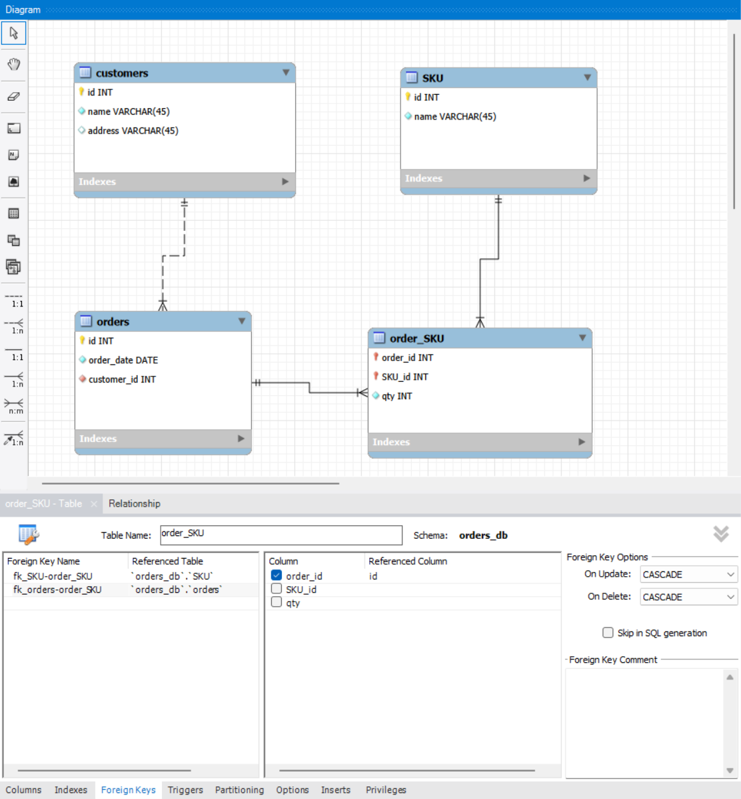
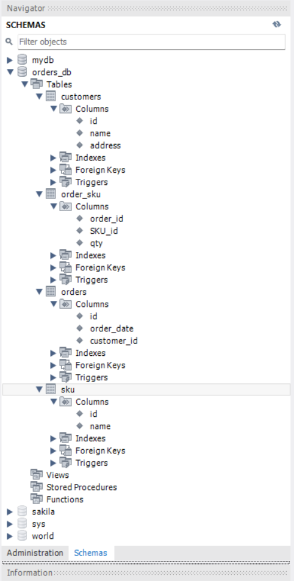

# Relational DB Homework 02

## Task
Normalize the initial table to 1NF, 2NF, and 3NF, create an ER diagram, and implement the database schema in MySQL Workbench.

## Project files
- `normalization.md` — step-by-step normalization from 1NF to 3NF
- `schema.sql` — SQL script for creating the schema and tables
- `er_diagram.png` — ER diagram of the final database structure
- `workbench_schema.png` — screenshot of the schema created in MySQL Workbench

## Final entities
- `customers`
- `orders`
- `SKU`
- `order_SKU`

## Relationships
- one customer → many orders
- one order → many order items
- one SKU → many order items

## ER Diagram

## Workbench Schema

